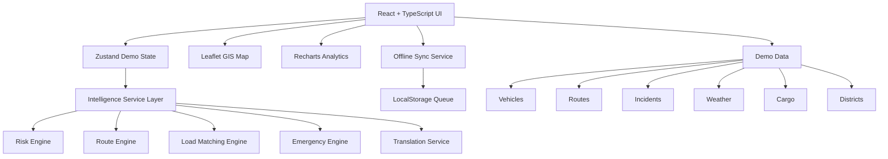

# NAVIRA

### Predict. Adapt. Deliver.

**An AI-assisted logistics and accessibility intelligence platform built for the North Eastern Region of India**

[](https://sih.gov.in)
[]()
[]()
[]()

**Team:** GRAMITRA. **Problem Statement Organization:** Ministry of Development of North Eastern Region (MDoNER). **Domain:** Transportation & Logistics

---

## Table of Contents

1. [The Problem We're Solving](#the-problem-were-solving)
2. [Why This Matters for the North East](#why-this-matters-for-the-north-east)
3. [Our Approach](#our-approach)
4. [What NAVIRA Actually Does](#what-navira-actually-does)
5. [System Architecture](#system-architecture)
6. [How a Disruption Gets Handled: A Walkthrough](#how-a-disruption-gets-handled-a-walkthrough)
7. [Technology Stack](#technology-stack)
8. [Getting Started](#getting-started)
9. [Demo Access](#demo-access)
10. [What's Real vs. What's Simulated](#whats-real-vs-whats-simulated)
11. [Roadmap to Production](#roadmap-to-production)
12. [Security & Responsible Technology](#security--responsible-technology)
13. [Known Limitations](#known-limitations)
14. [Team](#team)
15. [Disclaimer](#disclaimer)

---

## The Problem We're Solving

Ask anyone who moves goods through the North Eastern Region a simple question, "what went wrong last time?", and you rarely get a single answer. It's usually a combination: a landslide closed one road, a convoy got stuck behind it, nobody knew until the medicine was already three hours late, and the field officer who did know had no signal to report it.

That's the real challenge behind SIH26002. It isn't that disruptions happen. Geographically difficult terrain, monsoon weather, and limited road redundancy make that unavoidable. The challenge is that **disruptions are usually detected after they've already caused damage**, because the signals that could have predicted them (weather, road condition, terrain risk, traffic, past incident patterns) sit in different systems, different departments, or in someone's head, and never get combined in time to act on.

NAVIRA exists to close that gap: to fuse those scattered signals into one operating picture, early enough that a dispatcher can reroute a vehicle before it drives into a problem, not after.

## Why This Matters for the North East

The NER isn't logistically difficult in the abstract. It's difficult in very specific, well-known ways:

- A handful of trunk corridors often carry traffic that, elsewhere, would be spread across a denser road network, so losing one road can isolate a district.
- Weather volatility (landslide-prone slopes, flash floods, fog in higher elevations) can turn a normal route into a hazardous one within hours.
- Connectivity is inconsistent in exactly the areas where field intelligence matters most.
- Essential cargo, medicine, vaccines, food relief, emergency supplies, cannot simply wait for the next scheduled run when a corridor fails.

None of this is solved by a single clever algorithm. It's solved by good information plumbing: getting the right signal to the right decision-maker before the window to act closes. That's the design philosophy behind NAVIRA.

## Our Approach

We built NAVIRA around five verbs, because a logistics command platform ultimately has to support five kinds of decisions:

| Verb | What it means in practice |
|---|---|
| **Predict** | Surface corridor risk before it becomes a blocked road, using weather, terrain, traffic, incident, and historical-delay signals together. |
| **Adapt** | When conditions change mid-transit, recompute the safest available route and hand the dispatcher a clear alternative. |
| **Optimize** | Notice when a vehicle has spare capacity going the same direction as unassigned cargo, and match them. |
| **Report** | Let field officers log what they're seeing, even with no signal, and have it sync automatically once connectivity returns. |
| **Respond** | When something urgent happens, rank it correctly. A low-priority delay and a stranded medical convoy should never compete for the same attention. |

We deliberately chose explainability over black-box prediction for this MVP. A dispatcher who is told "this corridor is high-risk" with no reasoning behind it will not trust the system under pressure. A dispatcher who can see why, for example 40 percent weather, 25 percent road condition, 20 percent terrain, can make a judgment call, override it if needed, and trust it the next time. That decision shapes almost everything else described below.

## What NAVIRA Actually Does

### 1. Command Center
The default view for a control-room operator: live-look KPIs across active vehicles, critical cargo in transit, corridor risk levels, current weather impact, open incidents, connectivity health across the field network, and any active emergencies, all on one screen, so the first ten seconds of a shift tell you what actually needs attention.

### 2. Risk Intelligence Engine
Every corridor is scored using a transparent, weighted formula rather than an opaque model:

```
Risk Score =
    Weather Risk       x 0.25
  + Road Condition      x 0.25
  + Terrain Risk         x 0.20
  + Incident Density    x 0.15
  + Traffic Load          x 0.10
  + Historical Delay    x 0.05
```

The weights reflect what actually causes NER-specific disruptions most often (weather and road condition dominate), while still accounting for terrain difficulty, live incidents, congestion, and the corridor's own track record. Because the formula is visible, a judge, an operator, or a future auditor can trace exactly why a corridor was flagged. This is a rule-based, explainable engine, not a trained ML model, and we're upfront about that distinction (more on this in [What's Real vs. What's Simulated](#whats-real-vs-whats-simulated)).

### 3. Smart Route Optimization
When a corridor's risk crosses a threshold, NAVIRA doesn't just raise an alarm. It works the problem: it identifies the affected corridor, evaluates the alternate routes that exist between the same two points, compares their live condition, and recommends the safer option with the change visualized directly on the map.

### 4. Smart Load Sharing
Empty capacity is a hidden cost in every logistics network. NAVIRA's matching engine continuously checks whether an in-transit vehicle with spare room is heading somewhere close to unassigned cargo, weighing destination similarity, available capacity, cargo requirements, distance, and priority compatibility, and suggests a consolidation instead of dispatching a second vehicle.

### 5. Vehicle Intelligence
A focused, per-vehicle view: current status, active route, driver details, cargo manifest, connectivity state, the risk level of the route it's currently on, and core vehicle details. Everything a dispatcher needs before deciding whether to reroute, hold, or reassign.

### 6. Offline Field Reporting
Field officers are often exactly where connectivity is worst. NAVIRA's offline workflow lets them log a report regardless:

```
Field Report > Local Storage > Offline Queue > Connectivity Restored > Sync > Command Center
```

The MVP implements this queue using the browser's `localStorage`, which is sufficient to demonstrate the workflow end to end. A production build would replace this with a proper mobile-first offline store (see [Roadmap](#roadmap-to-production)).

### 7. Emergency Assistance
A dedicated workflow for moments that can't wait in the normal queue. Priority is calculated from incident severity, cargo criticality, loss of connectivity, and route risk together, so a single bad signal doesn't get buried under routine updates.

### 8. GIS Command Map
Built on Leaflet and OpenStreetMap, the map is the shared visual language for the whole platform: corridors, live vehicle positions, distribution hubs, hospitals, district boundaries, active incidents, risk zones, and recommended routes, all layered on one interactive canvas.

### 9. Analytics & Resilience Dashboard
Beyond the live view, NAVIRA tracks trends: corridor risk over time, delivery performance, network resilience indicators, vehicle utilization, and incident patterns. The kind of view a program manager, rather than a shift operator, would actually use.

### 10. Multilingual Field Support
A demo translation layer that lets field reports move between regional languages and the command center's working language. It currently runs on deterministic demo logic rather than a live translation API, again, clearly labeled as such.

### 11. Ask GRAMITRA: In-App Assistant
A floating assistant that answers operational questions using the platform's own demo data, such as which corridors are high risk right now, or how many vehicles are active, using rule-based logic today, with a clear path to a server-side generative AI backend in a future version.

## System Architecture



The architecture is intentionally modular: the UI never talks to demo data directly. Everything routes through an Intelligence Service Layer. That's not over-engineering for a hackathon; it's the seam where each rule-based engine gets swapped for a trained model or a live external API later, without touching the UI at all.

## How a Disruption Gets Handled: A Walkthrough

This is the scenario we use in the live demo, because it exercises every part of the system in a single, coherent story rather than as disconnected feature demos.

1. A medical convoy departs, carrying priority cargo.
2. Weather along its corridor starts deteriorating.
3. The Risk Engine recalculates corridor risk in real time.
4. The rising risk crosses the disruption threshold.
5. The affected corridor is flagged high-risk on the Command Center and the map.
6. The Route Engine evaluates alternatives and recommends a safer path.
7. Meanwhile, the Load Matching Engine notices a nearby vehicle with spare capacity.
8. That spare capacity is matched to nearby unassigned cargo.
9. A field officer, in a low-connectivity area, files a report on what they're observing on the ground.
10. The report queues locally and waits for connectivity.
11. The Emergency Engine raises the convoy's priority given its now-elevated risk and cargo criticality.
12. Connectivity returns, the queued report syncs, and the Command Center reflects the full picture.

End to end, that's Predict, Adapt, Optimize, Report, Respond. Not as five separate demo screens, but as one continuous operational sequence.

## Technology Stack

| Layer | Choices |
|---|---|
| **Frontend** | React, TypeScript, Tailwind CSS |
| **UI & Motion** | Lucide Icons, Framer Motion |
| **Data Visualization** | Recharts |
| **Maps & Geospatial** | Leaflet, OpenStreetMap |
| **State Management** | Zustand |
| **Offline Support** | PWA, Service Worker, browser `localStorage` |

We chose this stack for one reason above all: speed of iteration without sacrificing a production-realistic UI. Zustand keeps state logic simple enough to reason about during a hackathon sprint. Leaflet gives us a genuinely interactive GIS layer without licensing overhead. And the whole thing runs as a PWA, which matters directly for the offline-reporting use case.

## Getting Started

### Prerequisites

- Node.js
- npm
- Git

### Installation

```bash
git clone YOUR_GITHUB_REPOSITORY_LINK
cd NAVIRA
npm install
npm run dev
```

### Production Build

```bash
npm run build
npm run preview   # verify the production build locally
```

## Demo Access

No password is required. From the `/login` screen, pick any of the available demo roles to see the platform from that perspective:

- **Control Center**: the full command-and-control view
- **Field Officer**: the offline-first reporting workflow
- **Driver**: the in-transit, vehicle-level view

We built role-based views deliberately, because "logistics intelligence" means something different to a dispatcher watching twenty vehicles than it does to a driver who needs one clear instruction.

## What's Real vs. What's Simulated

We'd rather be upfront about this than have a judge discover it mid-demo. Here's exactly what's live logic versus what's demo data in this MVP:

| Component | Status |
|---|---|
| Risk scoring formula | Real, deterministic, explainable logic |
| Route comparison logic | Real logic, applied to demo route data |
| Load matching logic | Real matching algorithm, applied to demo fleet data |
| Emergency prioritization | Real logic, applied to demo incident and cargo data |
| Weather, traffic, incident data | Simulated feeds, structured to resemble real sources |
| Vehicle and driver data | Simulated fleet |
| Translation | Deterministic demo logic, not a live translation API |
| Offline sync | Uses browser `localStorage` as a stand-in for a production offline store |
| Government system integration | Not connected. This prototype does not touch any live government or operational logistics infrastructure |

The engines are real. The world they're reasoning about, for now, is simulated. That distinction is the whole point of an MVP: we wanted to prove the decision logic works before investing in production data pipelines.

## Roadmap to Production

### Weather
IMD weather services, Open-Meteo, for live corridor-level forecasting.

### Geospatial & Terrain
ISRO / Bhuvan datasets, richer GIS layers, PostGIS for spatial querying at scale.

### Transportation Data
Integration potential with ULIP, FASTag-related data, VAHAN, and the GSTN / E-Way Bill ecosystem: the existing government data rails this platform could plug into rather than duplicate.

### AI
Server-side Gemini integration for the Ask GRAMITRA assistant, machine-learning-based risk prediction trained on real historical disruption data, natural-language logistics queries, and predictive ETA modeling.

### Backend
A production architecture would look roughly like this:

```
React
  |
API Gateway
  |
Backend Services
  |
AI / ML Services
  |
PostgreSQL + PostGIS
  |
Operational Data
```

Because the intelligence layer is already modular (see [System Architecture](#system-architecture)), each engine can be replaced independently. The Risk Engine doesn't have to wait for the Route Engine to be production-ready, and vice versa.

## Security & Responsible Technology

This repository is a hackathon prototype and does not process real government or operational data. We've still thought through what production deployment would require, because "we'll add security later" is how prototypes fail audits:

- Authentication and role-based access control
- Encryption in transit and at rest
- API security and rate limiting
- Audit logging of operational decisions
- Data minimization, collecting only what's operationally necessary
- Secure offline synchronization (replacing `localStorage` with an encrypted local store)
- Infrastructure monitoring and alerting
- Protection of sensitive logistics and location data
- Validation and provenance checking of external data sources before they feed the Risk Engine

## Known Limitations

We're listing these deliberately, not defensively. A judge who finds an unstated limitation trusts the project less than one who reads it here first.

- All logistics, weather, vehicle, and incident data is simulated for demonstration.
- The risk engine is a deterministic rule-based model, not a trained ML model. This is by design, for explainability, at this stage.
- Translation is demo-only and not connected to a live translation service.
- Offline sync uses browser `localStorage`, which is appropriate for a demo but not for production-scale field use.
- No live government system is connected.
- No production database is required to run the current demo.
- No external AI service is required for the core demonstration to function.

## Team

### GRAMITRA

| | |
|---|---|
| **Idea** | NAVIRA |
| **Event** | Smart India Hackathon 2026 |
| **Problem Statement** | SIH26002 |
| **Organization** | Ministry of Development of North Eastern Region (MDoNER) |

## Disclaimer

NAVIRA is a Smart India Hackathon 2026 prototype, built for demonstration and evaluation purposes. All simulated operational data, risk conditions, vehicle states, weather, incidents, and logistics scenarios, exists to demonstrate the proposed system architecture and decision workflows. It should not be interpreted as, or connected to, a live operational logistics or government system.

---

## Project Links

- **Live Demo:** `https://navira-sih.vercel.app/`
- **GitHub Repository:** `https://github.com/SithickSahilAhamed/SIH2026-PS26002-AI-Smart-Logistics-NER`

---

<div align="center">

**Team GRAMITRA**

### NAVIRA: Predict. Adapt. Deliver.

*Built for Smart India Hackathon 2026*

</div>
