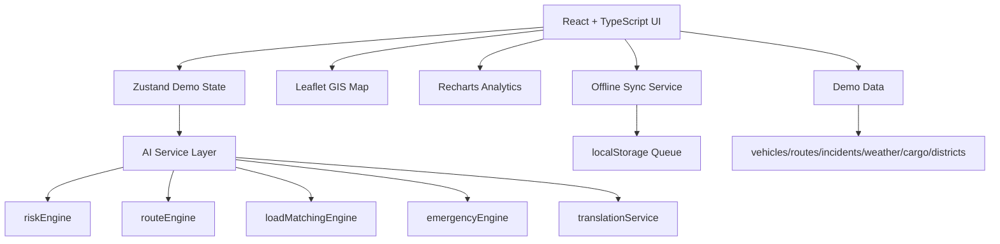

# GRAMITRA

**Predict. Adapt. Deliver.**

GRAMITRA is a hackathon MVP for Problem Statement ID 26002: an AI-based smart logistics and accessibility intelligence platform for the North Eastern Region. It is designed as a command-and-control prototype for risky corridors, extreme weather, road damage, weak connectivity, emergency cargo, and field intelligence.

This prototype uses clearly labeled **Demo Data** and **Simulated Feed** values. It does not claim live government integration.

## Problem

Remote NER logistics can fail because operators discover road blockages, weather hazards, and connectivity loss after deliveries are already delayed. Essential goods such as medicines and food need earlier warning, safer routing, field reporting, and emergency prioritization.

## Solution

GRAMITRA turns simulated weather, road, incident, terrain, traffic, vehicle, cargo, and field-report signals into operational decisions:

- Detect at-risk corridors before supply failure.
- Explain disruption risk with weighted contributors.
- Recommend safer alternate routes.
- Track vehicle and connectivity status.
- Match unused vehicle capacity with nearby cargo.
- Capture field reports offline and sync later.
- Prioritize emergency assistance for stranded critical cargo.
- Support multilingual demo translation for field reports.

## Features

- Command center dashboard with KPI cards and live demo scenario.
- Leaflet + OpenStreetMap GIS map with corridors, vehicles, hubs, hospitals, districts, incidents, and risk colors.
- AI Risk Intelligence Engine with transparent weighted scoring.
- Route Optimizer with animated recalculation and recommended Route B.
- Smart Load Sharing with match score and confirmation flow.
- Vehicle tracking table with route and driver detail panel.
- Field report screen with offline localStorage queue and sync animation.
- Emergency assistance flow with priority score and responder recommendations.
- Analytics dashboard with resilience score and charts.
- Floating rule-based “Ask GRAMITRA” assistant.
- PWA manifest and service worker cache fallback.

## Architecture



## AI Logic

Corridor risk is deterministic and explainable:

```txt
riskScore =
weatherRisk * 0.25 +
roadCondition * 0.25 +
terrainRisk * 0.20 +
incidentDensity * 0.15 +
trafficLoad * 0.10 +
historicalDelay * 0.05
```

Load matching uses destination similarity, available capacity, distance, and priority compatibility. Emergency priority uses severity, cargo criticality, connectivity loss, and route risk.

## Tech Stack

- React
- TypeScript
- Tailwind CSS
- Lucide icons
- Framer Motion
- Recharts
- Leaflet + OpenStreetMap
- Zustand
- PWA service worker
- localStorage offline queue

## How To Run

```bash
npm install
npm run dev
```

Build check:

```bash
npm run build
```

## Demo Credentials

No password is needed. On `/login`, click one of:

- Control Center
- Field Officer
- Driver

## Demo Scenario

Click **Run Live Demo** or **Judge Mode** from the top bar. The dashboard simulates:

1. Medical convoy moving normally.
2. Weather risk rising.
3. Disruption predicted.
4. Incident appears.
5. Corridor marked high risk.
6. Alternate route recommended.
7. Spare capacity matched.
8. Offline field report queued.
9. Emergency response prioritized.
10. Network state updated.

## Future Integrations

- IMD or Open-Meteo weather feeds.
- ISRO/Bhuvan terrain layers.
- ULIP middleware for FASTag, VAHAN, GSTN E-Way Bill.
- Server-side Gemini assistant endpoint.
- PostGIS-backed corridor and district geospatial queries.
- Firestore/PostgreSQL operational persistence.

## Limitations

- All logistics, weather, vehicle, incident, and AI values are demo simulations.
- No live government system is connected.
- Translation is deterministic and demo-only.
- Offline queue uses localStorage for hackathon simplicity.
- Risk scoring is explainable rules logic, not a trained production ML model.
